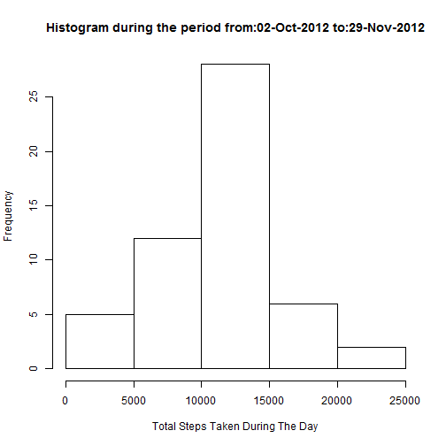
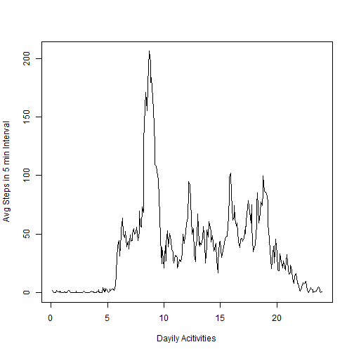
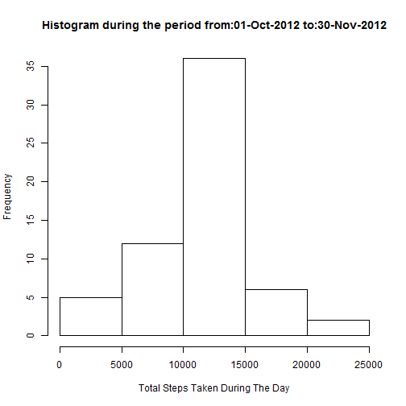
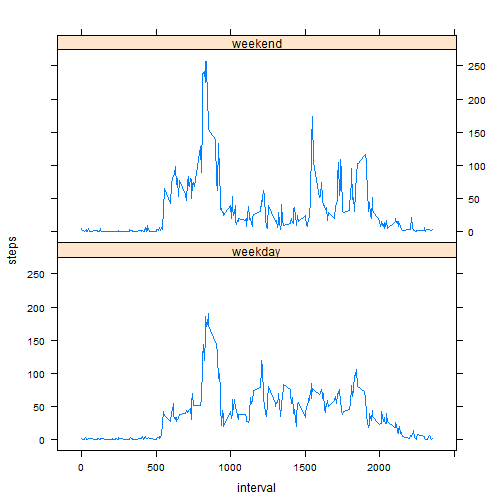

RMarkdown File Name: PA1_template.Rmd  
  
This is an R Markdown document to demonstrate the R Markdown functionality and solution to peer assignment 1. Markdown is a simple formatting syntax for authoring HTML, PDF, and MS Word documents.  

This is part of the reproducible research assignment #1  

Below is the  data for assignment   
Data Set: [Activity Monitoring Data](https://d396qusza40orc.cloudfront.net/repdata%2Fdata%2Factivity.zip)

##Loading and pre-processing the data  
Variables:-

- Steps
- Date
- Intervals

Data set is downlownloaded and unzipped in the local project directory "C:\\SKS\\R\\Project\\RR\\data"

Loading the csv data


```r
DATA_DIR<-"C:\\SKS\\R\\Project\\RR\\data\\";
FILE_NAME<-"activity.csv";
DATA_URL<-paste(DATA_DIR,FILE_NAME,sep="");


predata<-read.csv(DATA_URL,header=TRUE) ;

predata$date<-as.Date(predata$date,format='%Y-%m-%d')

# Interval to HH:MIN format  get the POSIX timestamp
#hhmm will be in HH:MIN format


# To map the week day and weekenda
# create a map and then create a factor for weekend and weekday
predata$day<-weekdays(predata$date)
f<-unique(predata$day)
map<-data.frame(day=f,type=c('weekday','weekday','weekend','weekend','weekday','weekday','weekday'))

predata<-merge(predata,map, all.x=TRUE)
```

##What is mean total number of steps taken per day?


```r
# remove NA
data<-predata[complete.cases(predata),]

#total number of steps per day

daytotalsteps<-aggregate(steps~date, data=data[,c('steps','date')], sum)


# histogram for total steps taken during the day for a period 

# From Date
s<-format (min(data$date), '%d-%b-%Y')
s
```

```
## [1] "02-Oct-2012"
```

```r
# To Date
e<-format (max(data$date), '%d-%b-%Y')
e
```

```
## [1] "29-Nov-2012"
```

```r
# Title of the Histogram

main<-paste("Histogram during the period from:",s," to:" ,e,sep="")


hist(daytotalsteps$steps, xlab="Total Steps Taken During The Day", main=main)
```

 

```r
# Media of total steps per day

median(daytotalsteps$steps)
```

```
## [1] 10765
```

```r
# Mean of total steps per day

mean(daytotalsteps$steps)
```

```
## [1] 10766.19
```

What is the average daily activity pattern?


```r
# 5 minutes average valueduring the period

# This mean of taken at every 5 minute interval across the period


avgsteps<-aggregate(steps~interval, data=data[,c('steps','interval')], mean,na.rm=TRUE)

# 5 min intervals

f<-round(seq(5,24*60,5)/60,1)


# Time seris plot

plot(f,avgsteps$steps, ylab="Avg Steps in 5 min Interval", xlab ="Dayily Acitivities",type ='l')
```

 

```r
#Which 5-minute interval, on average across all the days in the dataset, contains the maximum number of steps?

#get max avg steps
max(avgsteps$steps)
```

```
## [1] 206.1698
```

```r
# 5-minute interval, on average across all the days in the dataset, contains the maximum number of steps

avgsteps[avgsteps$steps==max(avgsteps$steps),1]
```

```
## [1] 835
```

```r
# in terms of hours 8 HRS 35 MINs
```
##Imputing missing values


```r
#missing rows

missingrows<-which(!complete.cases(predata))

# total number of missing rows

length(missingrows)
```

```
## [1] 2304
```

```r
# strategy to fill missing value  -> 5 min Average value from the daily pattern

avgsteps<-aggregate(steps~interval, data=data[,c('steps','interval')], mean,na.rm=TRUE)

# replace NA by a value from the daily pattern average

for (i in 1:length(missingrows) ) {
  predata[missingrows[i],]$steps<-avgsteps[avgsteps$interval==predata[missingrows[i],]$interval,]$steps
}

# above process replaces all NA by corresponding value from the daily pattern


#total number of steps per day

daytotalstepsnew<-aggregate(steps~date, data=predata[,c('steps','date')], sum)


# histogram for total steps taken during the day for a period 

# From Date
s<-format (min(predata$date), '%d-%b-%Y')
s
```

```
## [1] "01-Oct-2012"
```

```r
# To Date
e<-format (max(predata$date), '%d-%b-%Y')
e
```

```
## [1] "30-Nov-2012"
```

```r
# Title of the Histogram

main<-paste("Histogram during the period from:",s," to:" ,e,sep="")


hist(daytotalstepsnew$steps, xlab="Total Steps Taken During The Day", main=main)
```

 

```r
# Media of total steps per day

median(daytotalstepsnew$steps)
```

```
## [1] 10766.19
```

```r
# Mean of total steps per day

mean(daytotalstepsnew$steps)
```

```
## [1] 10766.19
```

```r
# impact on mean
mean(daytotalstepsnew$steps)-mean(daytotalsteps$steps)
```

```
## [1] 0
```

```r
# impact on median
median(daytotalstepsnew$steps)-median(daytotalsteps$steps)
```

```
## [1] 1.188679
```

```r
#impact on total steps
sum(daytotalstepsnew$steps)-sum(daytotalsteps$steps)
```

```
## [1] 86129.51
```

##Are there differences in activity patterns between weekdays and weekends?


```r
# To get a week day
#predata$day<-format(predata$date,'%A')
predata$day<-weekdays(predata$date)

wdays<-unique(predata$day)[1:5]
wdays
```

```
## [1] "Friday"   "Monday"   "Saturday" "Sunday"   "Thursday"
```

```r
wends<-unique(predata$day)[6:7]
wends
```

```
## [1] "Tuesday"   "Wednesday"
```

```r
avgstepswday<-aggregate(steps~interval, data=predata[predata$type=='weekday',c('steps','interval')], mean)

avgstepswend<-aggregate(steps~interval, data=predata[predata$type=='weekend',c('steps','interval')], mean)

split.screen(c(2, 1))
```

```
## [1] 1 2
```

```r
screen(1)
plot(f,avgstepswday$steps, ylab="Avg Steps in 5 min Interval", xlab ="Week Day Dayily Acitivities",type ='l')
screen(2)
plot(f,avgstepswend$steps, ylab="Avg Steps in 5 min Interval", xlab ="Week End Dayily Acitivities",type ='l')
```

 

```r
close.screen(all = TRUE)
```


